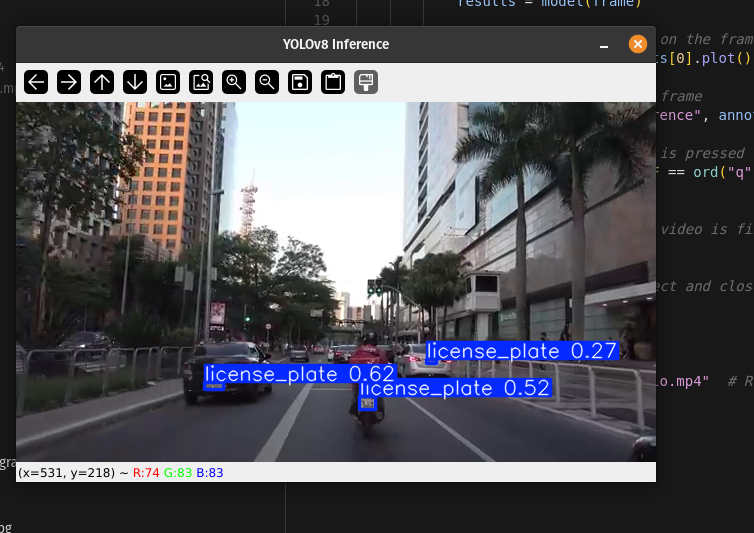
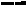
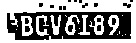
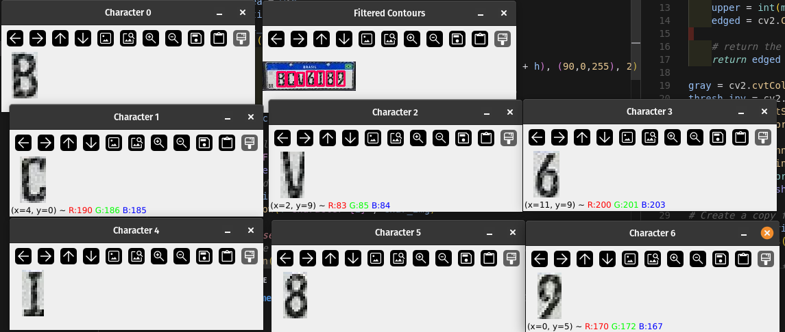

# case-computer-vision

# Code blog

Na definição do case foi dito que vocês gostariam de ter uma visão geral de como o candidato ataca o problema, a linha de raciocínio e a solução proposta. Pensando nisso vou tentar resumir passo a passo o que eu fiz pra resolve-lo. 

### Contexto 23/01/2025 04:44PM

Gostaria de deixar claro que na semana que recebi o case, tive que trabalhar sabado e domingo para restruturar um projeto do zero que estava todo quebrado com criação de roadmaps e tarefas, além disso uma entrega extremamente urgente de um outro produto para não travar a operação da empresa com o mesmo deadline do case e a entrega de um freela. Dito isso, não tenho tempo para atacar o problema como eu gostaria de atacar, mas vou tentar fazer o melhor que eu puder.

### Analisando o problema 23/01/2025 04:48PM
Meu primeiro passo foi entender o problema e fazer algumas suposições de como resolver o problema e os diferentes cenários, meus passos iniciais foram:
- Pensei: preciso fazer uma solução que funcione em diversos cenários, levando em consideração exposição de luz, resolução de camera, angulo de visão, etc...
- Pesquisei no google um pouco sobre métodos para melhorar resolução e qualidade de imagens, cheguei em alguns papers interessantes, deixei separado para caso de tempo começar a trabalhar nisso.
- Encontrei um paper que me ajudou a entender melhor o problema e como resolver. [Studies advanced in license plate recognition](https://www.researchgate.net/publication/372823340_Studies_Advanced_in_License_Plate_Recognition)

### 24/01/2025 05:11PM
Nesse momento acabei de terminar de ler o Paper, a conclusão que eu cheguei confirma minha intuição de que a melhor solução seria dividir o problema em multiplas etapas, e é assim que vou atacar o problema. Ainda não decidir como vou atacar cada etapa, mas vou começar a pensar nisso daqui a pouco.
Etapas:
1) Preprocessamento da imagem
2) Detecção da placa
3) Segmentação dos caracteres da placa
4) Reconhecimento dos caracteres da placa

### 24/01/2025 05:22PM
Para ser sincero, fazia tempo que não fazia uma CLI então dei uma leve pesquisada em bibliotecas para me ajudar. Encontre a [Fire](https://github.com/google/python-fire/blob/master/docs/guide.md) do Google, dei uma lida na documentação, vi que é simples de implementar e decidi usar ela. Não quero gastar tempo com isso.

### 24/01/2025 05:47PM
Fiquei um tempo procurando por datasets, encontrei alguns, mas o que mais me chamou atenção foi um dataset com placas diversas, diferentes angulos e resoluções(com labels para treinamento e avaliação). Agora que tenho um dataset, preciso pensar em como vou atacar cada etapa. Vou começar de maneira básica utilizando YOLO para detectar as placas. [Dataset](https://www.kaggle.com/datasets/fareselmenshawii/license-plate-dataset)

### 24/01/2025 06:47PM
Coloquei o modelo para treinar, percebi que sou GPU POOR (4gb de memória) isso fez com que eu tivesse que reduzir o tamanho da imagem para 416x416, regular o batch para 6 e o learning rate para 1e-4. Vou para academia agora, vou deixar treinando e ver o que vai dar. Se o resultado não for bom, vou tentar treinar utilizando multiplos GPUS em cloud. 

### 25/01/2025 08:06AM
Deixei o modelo treinando, quando cheguei em casa ele tava em 57/100 epochs pausei o treinamento para testar e acabei dormindo. Ou seja, a oportunidade de treinar mais o modelo foi perdida, pelo menos localmente, meu objetivo agora é testar o modelo com 2/3 vídeos que eu achar na internet e ver se ele consegue detectar as placas.
Vou testar usando esses dois vídeos: https://www.youtube.com/watch?v=39eKuBwiOv0&t=5s e https://www.youtube.com/watch?v=T564pDqXc6A

### 25/01/2025 08:24AM
Testei aqui e vi que o modelo consegue detectar as placas, ele não dectou algumas placas mas em geral da pra brincar. Fiquei muito animado em ver o resultado. kkkk 

### 25/01/2025 08:53AM
Estou fazendo alguns testes, já estou salvando de maneira separada cada placa detectada. Tive que enfrentar um problema que foi o modelo salvar multiplas imagens de uma mesma placa, mas consegui resolver com um mecanismo de deduplicação de imagens, ainda preciso ajustar o threshold de similaridade, mas vou deixar para depois, vou focar no processademnto de um frame agora. Se der tempo quero implementar um mecanismo pegar a melhor imagem de cada placa.

### 25/01/2025 09:20AM
Adicionei a etapa de preprocessamento de imagem:
1) Converto para uma escala cinza para aumentar o contraste entre os caracteres e o background
2) Aplico um threshold adaptativo para binarizar a imagem, isso me ajuda a remover o background
3) Aplico um filtro de morfologia para remover o ruido 

Ela tem me trazido resultados esperados quando a qualidade e resolução da placa é boa. Mas quando a resolução da placa é baixa, ele acaba escondendo os caracteres. Preciso começar a trabalhar em breve e assertividade não é prioridade no case então vou relevar por enquanto.
Placa baixa resolução:

Placa alta resolução:

### 25/01/2025 09:42AM
Adicionei a etapa de OCR, ela me trouxe um resultado ok, não foi perfeito. Esperava um resultado bem melhor dado que a placa parece bem nitida pra mim. O resultado esperado era "BCV6I89", mas o resultado foi "KBCVOI89 _ ". Vou adicionar a etapa de segmentação de caracteres e tentar melhorar o resultado. Meu tempo está acabando, então vou focar em placas brasileiras de alta resolução.

### 25/01/2025 10:59AM
Uma hora se passou desde a última etapa e não consegui avançar no resultado, apenas em conhecimento. Não estou conseguindo segmentar os caracteres da placa de maneira agradável, muito provavelmente por estar tentando fazer sem estudar muito, vou pesquisar de maneira mais aprofundada cada etapa, entender os conceitos fundamentais e tentar novamente.

### 25/01/2025 00:47PM
Dei uma refatorada no código e consegui finalmente adicionar a etapa de segmentação de caracteres, após encontrar algumas soluções na internet. Sei que o caminho mais fácil talvez teria sido utilizar o próprio YOLO já treinado para segmentar os caracteres, mas eu queria entender uma alternativa diferente do que só plugar uma rede neural já treinada. Além de claro ter um processamento computacional mais barato.

### 25/01/2025 02:14PM
Tive que fazer uma série de outras coisas durante esse tempo, mas finalmente consegui acertar 100% dos caracteres de uma placa. Minha ideia agora é generalizar a solução, incluir mais algumas etapas para melhorar a precisão. Para atingir os resultados que eu precisava do OCR adicionei um padding nas imagens dos caracteres e redimensionei para 28x28.

### 25/01/2025 04:16PM
Adicionei uma etapa de tracking para acompanhar os veiculos, meu objetivo é pegar a melhor imagem de cada placa. Isso acaba com a nececessidade de deduplicação de placas. Eu decidi não implementar o processamento em tempo real pra não estourar a memória já que guardo o histórico de todos os veículos, então vou calcular um score levando em consideração a confiança e resolução da placa. Após processar o vídeo inteiro, vou capturar a imagem de fato baseado no score e processa-la para descobrir a placa.

### 25/01/2025 06:27PM
Terminei o pipeline completo utilizando tracking, agora ele detecta os veiculos e extrai a melhor imagem de cada placa, o problema é que as placas com baixas resoluções acabam sendo muito ruins para o OCR, mesmo fazendo resize ( por conta do ruído).

### 25/01/2025 08:06PM
Fiz alguns testes, consegui identificar algumas placas e consegui validar que a segmentação de caracteres está funcionando - com muito espaço para melhorias. Infelizmente não vou ter tempo para melhorar dado as circunstâncias, mas vou deixar o código pronto para que vocês possam testar. 